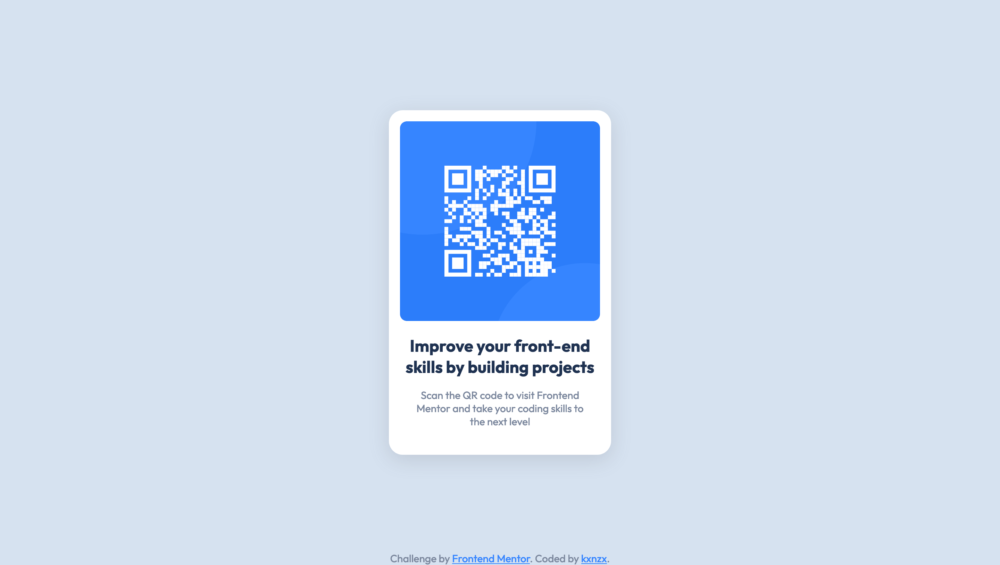
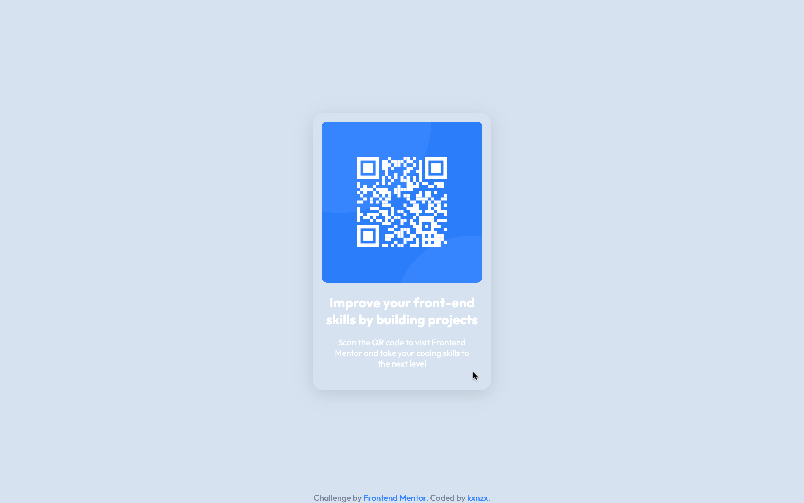

# Frontend Mentor - QR Code Component Solution

This is a solution to the [QR code component challenge on Frontend Mentor](https://www.frontendmentor.io/challenges/qr-code-component-iux_sIO_H). Frontend Mentor challenges help you improve your coding skills by building realistic projects.

## Table of contents

- [Overview](#overview)
  - [Screenshot](#screenshot)
  - [Links](#links)
- [My process](#my-process)
  - [Built with](#built-with)
  - [What I learned](#what-i-learned)
  - [Continued development](#continued-development)
- [Author](#author)

## Overview

### Screenshot

#### Screensize 1440px - Desktop



#### Card Hover State



#### Screensize 375px - Mobile


### Links

- View my Solution on [Frontend Mentor](https://your-solution-url.com)
- View the Live Site [here](https://your-live-site-url.com)

## My process

- HTML semantics
- Importing Google Fonts
- Set variables in root
- Reset default settings
- Global Styles (Mobile First)
- Content Styles
- Layout Styles (Mobile First)

### Built with

- Semantic HTML5 markup
- CSS custom properties
- CSS Grid
- Mobile-first workflow
- [Google Fonts](https://fonts.google.com/) - For Fonts

### What I learned

- I found a new method to vertically and horizontally center with CSS Grid:

```css
body {
  display: grid;
  place-items: center;
}
```

- Based on my experience positioning the footer at the bottom of the page is one of the most stubborn pieces of work in CSS world. I have found out that you have to take several variables into account before you just see what sticks. In this case the cause was that there is not enough content on the page which resulted in the footer hovering somewhere in the middle of the page. I solved this by setting the properties and values as seen below. Keep in mind this solution (the rules that are set in the footer specifically) do not always apply in other cases when for example there is alot of content on the page that overflows out of it's main. What is always a constant is that you need to set the min-heigth on 100vh:

```css
body {
  min-height: 100vh;
}

footer {
  position: fixed;
  bottom: 0;
}
```

- I gave the card a hover state and I wanted the title and text to change color simultaneously. Selecting multiple elements on one line did not work here. I had to select the elements separately and in this specific order:

```css
.card:hover {
  background-color: transparent;
}

.card:hover h2 {
  color: var(--white);
}

.card:hover p {
  color: var(--white);
}
```

### Continued development

What, Where, When and Why for everything CSS related.

## Author

- Frontend Mentor - [@kxnzx](https://www.frontendmentor.io/profile/kxnzx)
